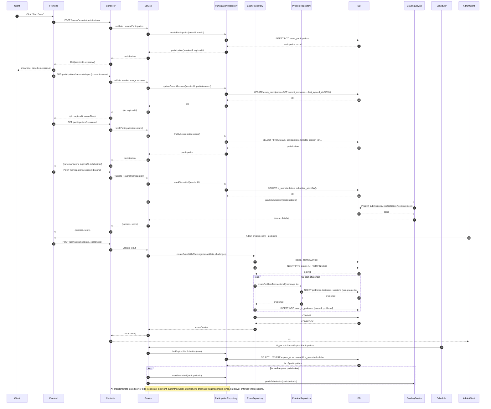

# Exam Feature — Sequence Diagram (Mermaid)

Below is a Mermaid sequence diagram illustrating the main exam flows: start participation, autosave/sync, resume, submit, admin create exam (atomic create problems), and auto-submit.

Notes:

- Repository methods accept an optional `tx` parameter so `ExamRepository` can compose a single transaction that calls `ProblemRepository.createProblemTransactional(..., tx)` for atomicity.
- Server time is authoritative for expiry checks; client timestamps are auxiliary only.
- You can paste this Mermaid block into any Markdown that supports Mermaid (e.g., GitHub with Mermaid enabled, or a docs site that renders Mermaid).
