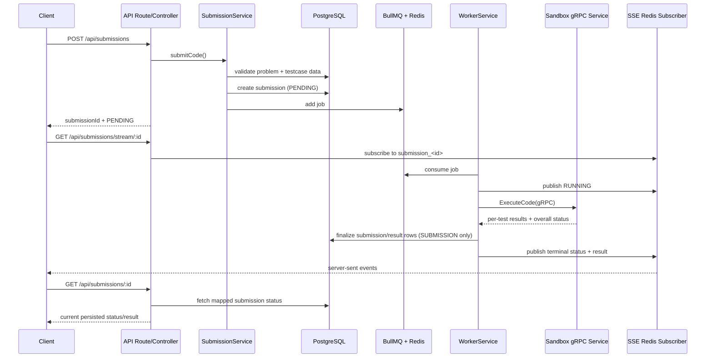

# Submission Architecture

## Purpose

This document describes the current backend submission pipeline as it exists on `main`.
It is intended for backend developers who need to understand where submission state
is created, how code is executed, and how results move back to clients.

This document focuses on the function-signature judge flow that was stabilized during
the post-migration refactor. For operational checks and incident handling, see
`docs/SUBMISSION_RUNBOOK.md`.

## Scope

The submission pipeline currently covers these user-facing paths:

- `POST /api/submissions`
- `POST /api/submissions/run`
- `GET /api/submissions/:submissionId`
- `GET /api/submissions/:submissionId/results`
- `GET /api/submissions/stream/:submissionId`
- `GET /api/submissions/queue/status`

Two execution modes share most of the same runtime:

- `SUBMISSION`: persisted submission, scored, finalized into PostgreSQL
- `RUN_CODE`: ad hoc execution for "run code" flows, queued and streamed, but not finalized into submission/result tables

## High-Level Flow

## Runtime Components

### API route and controller boundary

Entry point: [submission.routes.ts](/D:/Workspace/TLCN/project/backend/apps/api/src/routes/submission.routes.ts)

Responsibilities:

- apply authentication for create/run/status/result endpoints
- allow JWT via query string for SSE stream endpoints through the shared auth middleware
- apply route-level rate limits
- validate request body/query using shared Zod schemas
- delegate to `SubmissionController`

Controller: [submission.controller.ts](/D:/Workspace/TLCN/project/backend/apps/api/src/controllers/submission.controller.ts)

Responsibilities:

- map HTTP requests to service calls
- set SSE response headers and heartbeat
- terminate SSE streams when a terminal status is observed
- truncate oversized testcase outputs in streamed payloads

The controller is intentionally thin. It does not know queue mechanics, wrapper generation,
or persistence details.

### Submission service orchestration

Main orchestration lives in [submission.service.ts](/D:/Workspace/TLCN/project/backend/apps/api/src/services/submission.service.ts).

Key responsibilities:

- validate that the problem exists
- require `problem.functionSignature`
- require structured testcase data: `inputJson` and `outputJson`
- normalize `functionSignature` before queueing or result mapping
- create persisted submissions for `POST /api/submissions`
- enqueue both `SUBMISSION` and `RUN_CODE` jobs
- map persisted results back into display-ready payloads

Important behavior:

- unsupported languages are rejected early
- missing `functionSignature` or missing structured testcase JSON is treated as a server-side configuration error
- `RUN_CODE` generates a synthetic submission ID and uses the same queue/runtime path without writing a submission row first

### Queue runtime

Queue runtime lives in [judge-queue.ts](/D:/Workspace/TLCN/project/backend/packages/shared/runtime/judge-queue.ts).

Responsibilities:

- lazily create the BullMQ queue instance
- lazily create a Redis publisher for submission update fanout
- enqueue jobs with retry policy:
  - `attempts: 3`
  - exponential backoff
- expose queue health and queue length
- publish submission update events on Redis channel `submission_updates`

The queue payload is function-signature-first. Each job contains:

- submission metadata
- normalized `functionSignature`
- structured testcase JSON
- time/memory limits
- `jobType` (`SUBMISSION` or `RUN_CODE`)

### Worker execution layer

Execution orchestration lives in [worker.service.ts](/D:/Workspace/TLCN/project/backend/apps/worker/src/services/worker.service.ts).

Responsibilities:

- consume BullMQ jobs
- publish `RUNNING` updates before sandbox execution
- generate the language-specific wrapper around user code
- convert structured testcase JSON into canonical execution payloads
- call the sandbox over gRPC
- remap sandbox output back to display-oriented testcase rows
- calculate final status and score
- finalize persisted submissions for `SUBMISSION` jobs
- publish terminal updates for both `SUBMISSION` and `RUN_CODE`

Important behavior:

- if a BullMQ job exhausts retries, the worker forces `SYSTEM_ERROR` for persisted submissions
- terminal results are still published to SSE even when finalization fails late
- `RUN_CODE` skips DB finalization and only streams the result

### Wrapper generation

Wrapper generation lives in [wrapperGenerator.ts](/D:/Workspace/TLCN/project/backend/apps/worker/src/services/wrapperGenerator.ts).

Responsibilities:

- normalize the function-signature contract to canonical recursive types
- build a language-specific execution wrapper for C++, Java, and Python
- parse input as a JSON object keyed by argument name
- call `Solution.<functionName>(...)`
- emit a JSON envelope containing:
  - `actual_output`
  - `time_taken_ms`

Design constraint:

- the wrapper injects a fixed set of runtime helpers and standard headers/imports
- it does **not** add arbitrary language-library imports for the user
- example: a C++ solution using `unordered_map` must still include `#include <unordered_map>` in user code

### Sandbox boundary

Sandbox gRPC entrypoint: [server.ts](/D:/Workspace/TLCN/project/backend/apps/sandbox/src/grpc/server.ts)

Responsibilities:

- receive `ExecuteCode` requests from the worker
- adapt gRPC testcases to the sandbox execution service
- map raw execution results to protocol-level statuses
- classify compile failures, runtime failures, TLE/MLE, and wrong answers

The sandbox returns per-test results. The worker, not the sandbox, is responsible for:

- publishing Redis updates
- final status persistence
- score calculation
- enriching testcase rows with display-oriented input/expected output

### Submission finalization

Finalization logic lives in [submission-finalization.ts](/D:/Workspace/TLCN/project/backend/packages/shared/runtime/submission-finalization.ts).

Responsibilities:

- transactionally move a submission from `PENDING`/`RUNNING` into a terminal status
- replace `result_submissions` rows atomically
- apply ranking-point increments once, guarded by advisory locking
- keep finalization idempotent for retried jobs

This module is shared runtime logic so both service-level and worker-level finalization use
the same invariants.

### SSE fanout

Realtime update fanout lives in [sse.service.ts](/D:/Workspace/TLCN/project/backend/apps/api/src/services/sse.service.ts).

Responsibilities:

- subscribe once to Redis channel `submission_updates`
- re-emit updates in-process as `submission_<submissionId>` events
- let HTTP SSE handlers attach/detach per-submission listeners

Important behavior:

- the SSE stream ends when a terminal status arrives
- the stream sends heartbeat frames every 15 seconds
- `X-Accel-Buffering: no` is set to keep nginx from buffering SSE responses

## Submission Lifecycle

### 1. Create or run-only request

For `POST /api/submissions`:

1. auth middleware resolves `userId`
2. request body is validated against the shared submission schema
3. `SubmissionService.submitCode()` validates problem/testcases
4. a persisted submission row is created with `PENDING`
5. a queue job is created and submitted
6. the API returns `submissionId`, status, queue position, and estimated wait time

For `POST /api/submissions/run`:

1. the same validation path runs
2. no submission row is created
3. a synthetic UUID is generated
4. a `RUN_CODE` job is enqueued
5. the API returns the synthetic ID and `PENDING`

### 2. Worker pickup

When a BullMQ worker receives the job:

1. it publishes a `RUNNING` event
2. it builds the wrapper around the user code
3. it serializes testcase `inputJson` to JSON strings
4. it canonicalizes `outputJson` for sandbox comparison
5. it sends the gRPC request to the sandbox

### 3. Sandbox execution

The sandbox receives:

- wrapped source code
- language
- resource limits
- testcase input and expected output

The sandbox executes each testcase and returns per-test rows. Compile failures are converted
to `COMPILATION_ERROR` at the sandbox boundary before they reach the worker.

### 4. Final status and score

The worker:

1. remaps testcase rows back to display fields using the function signature
2. derives final status with shared judge utilities
3. calculates score from testcase weights
4. finalizes the submission in PostgreSQL for `SUBMISSION`
5. publishes a terminal Redis update with status/result/score

### 5. Client observation model

Clients can observe progress through two channels:

- SSE stream: low-latency progress and terminal updates
- polling endpoints: persisted status/result fetches from PostgreSQL

This split is intentional:

- SSE gives immediate feedback
- HTTP status/result endpoints remain the source of truth for persisted submissions

## Status Model

Non-terminal statuses:

- `PENDING`
- `RUNNING`

Terminal statuses currently used in the submission pipeline:

- `ACCEPTED`
- `WRONG_ANSWER`
- `TIME_LIMIT_EXCEEDED`
- `MEMORY_LIMIT_EXCEEDED`
- `RUNTIME_ERROR`
- `COMPILATION_ERROR`
- `SYSTEM_ERROR`
- `INTERNAL_ERROR`

The SSE controller also accepts some short aliases from older payloads when deciding whether
to terminate a stream, but the current runtime normalizes to the long-form statuses above.

## Data Contracts and Invariants

### Function-signature contract

The submission runtime assumes:

- `problem.functionSignature` exists
- it can be normalized by the shared function-signature normalizer
- testcase inputs are stored as structured JSON objects keyed by argument name
- testcase outputs are stored as structured JSON values

If any of these are false, submission preparation fails before queueing.

### Queue job contract

The queue job is not a raw copy of the submission row. It is an execution packet that already
contains:

- normalized function signature
- structured testcase inputs/outputs
- resolved limits

This keeps the worker isolated from HTTP concerns and reduces runtime reads after dequeue.

### Persistence invariants

Persisted submissions are finalized transactionally:

- only `PENDING` and `RUNNING` may transition to terminal
- result rows are replaced atomically
- ranking points are awarded once for first accepted non-exam solves

## Security and Failure Boundaries

### API boundary

- request schema validation happens before the controller
- auth is required for create/run/status/result endpoints
- SSE accepts JWT from normal `Authorization` headers and query-string token flow used by the shared auth middleware

### Worker boundary

- retries are handled at the queue layer
- exhausted retries become `SYSTEM_ERROR`
- malformed queue testcase structure fails early before sandbox execution

### Sandbox boundary

- compile/runtime classification is performed here before results return to the worker
- sandbox errors that prevent a valid result envelope become execution failures seen by the worker

### Proxy boundary

- nginx is configured for dynamic service resolution and no SSE buffering
- runtime issues caused by stale containers are operational, not architectural, and are covered in the runbook

## Relationship To Other Docs

- [EXECUTION_FLOW.md](/D:/Workspace/TLCN/project/backend/docs/EXECUTION_FLOW.md): broader execution-platform overview
- [SANDBOX_ARCHITECTURE.md](/D:/Workspace/TLCN/project/backend/docs/SANDBOX_ARCHITECTURE.md): sandbox-specific details
- [release/full-pipeline-e2e.md](/D:/Workspace/TLCN/project/backend/docs/release/full-pipeline-e2e.md): operator E2E verification flow
- [SUBMISSION_RUNBOOK.md](/D:/Workspace/TLCN/project/backend/docs/SUBMISSION_RUNBOOK.md): operational checks, failure signatures, and recovery steps
